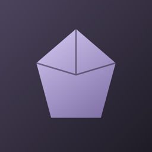

<div align="center">



# Netherite — landing page

**The website for [Netherite](https://github.com/Im-Fran/Netherite), a native, local-first notes app for Mac, iPhone and iPad.**

[](LICENSE)
[](https://angular.dev)
[](https://tailwindcss.com)
[](https://www.typescriptlang.org)
[](https://workers.cloudflare.com)

[Netherite app](https://github.com/Im-Fran/Netherite) · [Latest release](https://github.com/Im-Fran/Netherite/releases/latest)

</div>

---

## 📖 Overview

A single-page, fully static site that presents Netherite: a notes app that keeps your knowledge in plain Markdown files you own and opens Obsidian vaults as-is. The page walks through the app's features, shows an editor mock-up, explains that a vault is just a folder, and sends visitors to the latest release and the GitHub repository.

It is built with Angular and Tailwind CSS v4, has no backend and needs no environment variables. Its colors come straight from the app's default **Netherite** theme ([`Theme.swift`](https://github.com/Im-Fran/Netherite/blob/dev/Packages/NetheriteCore/Sources/NetheriteCore/Vault/Theme.swift)), in light and dark.

---

## ✨ Highlights

- **Bilingual (EN / ES)** — Picks the language from `navigator.language`, lets visitors switch from the nav bar and remembers the choice in `localStorage`. The document `lang`, title and meta description follow the active language.
- **The app's own theme** — The Netherite palette lives in `src/styles.css` as `--nth-*` custom properties, mapped to Tailwind tokens, with a dark variant that follows `prefers-color-scheme`.
- **Accessible by default** — Skip link, labelled navigation, decorative elements hidden from assistive tech, a screen-reader caption for the editor mock-up and `prefers-reduced-motion` respected.
- **Share-ready** — Description, Open Graph tags, favicon, touch icon and light/dark `theme-color`.
- **Lean** — Angular standalone component with signals; styling is Tailwind utilities plus a handful of CSS variables. Production builds have size budgets (500 kB warning / 1 MB error for the initial bundle).

---

## 🛠 Tech Stack

| Layer | Technology |
|-------|-----------|
| Framework | Angular 22 (standalone component, signals) |
| Language | TypeScript 6 |
| Styling | Tailwind CSS 4 via `@tailwindcss/postcss` |
| Build | `@angular/build` (application builder, Vite dev server) |
| Hosting | Cloudflare Workers (static assets) |

---

## 📋 Requirements

- **Node.js** — 24.18.0 (pinned in `.nvmrc`); any release supported by Angular 22 works
- **npm** 11 (the repo pins `npm@11.19.1` in `packageManager`)
- **Git**

---

## 🚀 Getting Started

```bash
git clone https://github.com/Im-Fran/netherite-landing.git
cd netherite-landing
npm install
npm start
```

Open [http://localhost:4200](http://localhost:4200). The page reloads as you edit.

### Scripts

| Command | What it does |
|---------|--------------|
| `npm start` | Dev server (`ng serve`) on port 4200 |
| `npm run build` | Production build into `dist/netherite-landing/browser` |
| `npm run watch` | Development build that rebuilds on change (`ng build --watch --configuration development`) |

There is no test or lint script; `npm run build` is the check that everything compiles.

---

## 🌐 Deployment

The site is deployed as static assets on **Cloudflare Workers**, built by Workers Builds:

| Setting | Value |
|---------|-------|
| Production branch | `dev` |
| Build command | `npm run build` |
| Deploy command | `npx wrangler deploy` |
| Assets directory | `dist/netherite-landing/browser`, set in [`wrangler.jsonc`](wrangler.jsonc) |
| Node.js | `24.18.0`, read from [`.nvmrc`](.nvmrc) |

Workers has no output-directory field in the dashboard: the assets directory lives in `wrangler.jsonc`, and its `name` must match the Worker's name (`netherite`). Without that file, Wrangler guesses `dist/` and the site answers 404 at `/`. Angular 22 needs Node `^22.22.3 || ^24.15.0 || >=26`; `.nvmrc` keeps the build on a supported version even if the default changes.

Any static host works with the same build command and output directory.

---

## 🗂 Project Structure

```text
src/
├── index.html      # Meta tags, Open Graph, theme-color
├── main.ts         # Bootstraps the app
├── styles.css      # Tailwind import + Netherite theme tokens (--nth-*)
└── app/
    ├── app.ts      # Language state, document title/description, repo and download URLs
    ├── app.html    # Header, hero + editor mock-up, features, vault folder, open-source CTA, footer
    ├── app.config.ts
    └── i18n.ts     # All copy, in English (`en`) and Spanish (`es`)
public/             # icon.png, favicon.png
```

---

## 🎨 Customizing

- **Copy** — Edit `src/app/i18n.ts`. The `en` object defines the shape (`Strings`) and `es` must match it, so a missing key fails the build.
- **Colors** — Edit the `--nth-*` variables in `src/styles.css`. They mirror the app's `Theme.swift`, so keep them in sync with it.
- **Links** — The repository and the download button both derive from the `REPO` constant in `src/app/app.ts`.
- **A third language** — The switch is an `en` ↔ `es` toggle, so besides adding the strings you also need to update `Lang`, `initialLang()` and `toggle()` in `src/app/app.ts` and `src/app/i18n.ts`.

> The language is chosen on the client, so crawlers and visitors without JavaScript get English. Angular's built-in i18n builds would be the upgrade path if per-language SEO matters.

---

## 🤝 Contributing

Issues and pull requests are welcome. `dev` is the default and production branch, so open pull requests against it, and run `npm run build` before you do.

---

## 📄 License

This project is licensed under the **GNU GPLv3** — see the [LICENSE](LICENSE) file for details. It is the same license as [Netherite](https://github.com/Im-Fran/Netherite). © FranciscoSolis E.I.R.L.

---

<div align="center">
Made with ☕ by Fran · <a href="https://fsolism.cl">FranciscoSolis E.I.R.L.</a>
</div>
